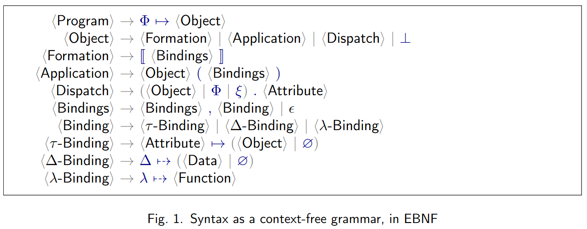

# normalizer metrics

## PHI grammar



## Metrics

We count:

- [Object applications](#object-applications)
- [Object formations](#object-formations)
- [Dynamic dispatches](#dynamic-dispatches)
- [Dataless formations](#dataless-formations)

### Object formations

- ` d ↦ ∅, c ↦ ∅ `

### Object applications

- `ξ.b(c ↦  )`

### Dynamic dispatches

- `ξ.ρ.c`

### Dataless formations

#### Definition: Δ-height

Δ-height represents how far down we need to go inside (nested) formations to reach a Δ-binding.

Δ-height for:

- everything except a non-empty formation: `∞`
- a formation with a delta-binding: `1`
- any other formation: `1 + minimal height among attributes`
  - `min(N, ∞) = min(∞, N) = N`
  - `1 + ∞ = ∞`

#### Definition: Dataless formation

Dataless formation - a formation with the height `∞` or greater than `2`.

#### Example

`{ α0 ↦ Φ.something(α1 ↦  α2 ↦  α3 ↦  Δ ⤍ 01- , α4 ↦    ) }`

| Formation                                                                       | Height | Dataless |
| ------------------------------------------------------------------------------- | ------ | -------- |
| ` Δ ⤍ 01- `                                                                   | `1`    | False    |
| ` `                                                                           | `∞`    | True     |
| ` α3 ↦  Δ ⤍ 01- , α4 ↦   `                                                | `2`    | False    |
| ` α2 ↦  α3 ↦  Δ ⤍ 01- , α4 ↦    `                                       | `3`    | True     |
| ` α0 ↦ Φ.something(α1 ↦  α2 ↦  α3 ↦  Δ ⤍ 01- , α4 ↦    ) `            | `∞`    | True     |

## Environment

{{#include ../common/sample-program.md}}

## CLI

### `--help`

```$ as console
normalizer metrics --help
```

```console
Usage: normalizer metrics [FILE] [-o|--output-file FILE]
                          [-b|--bindings-by-path PATH]

  Collect metrics for a PHI program.

Available options:
  FILE                     FILE to read input from. When no FILE is specified,
                           read from stdin.
  -o,--output-file FILE    Output to FILE. When this option is not specified,
                           output to stdout.
  -b,--bindings-by-path PATH
                           Report metrics for bindings of a formation accessible
                           in a program by a PATH. The default PATH is empty.
                           Example of a PATH: 'org.eolang'.
  -h,--help                Show this help text
```

### `FILE`

```$ as json
normalizer metrics program.phi
```

```json
{
  "bindingsByPathMetrics": {
    "bindingsMetrics": [
      {
        "metrics": {
          "applications": 1,
          "dataless": 1,
          "dispatches": 4,
          "formations": 4
        },
        "name": "a"
      }
    ],
    "path": []
  },
  "programMetrics": {
    "applications": 1,
    "dataless": 1,
    "dispatches": 4,
    "formations": 5
  }
}
```

### `FILE` not specified (read from stdin)

```$ as json
cat program.phi | normalizer metrics
```

```json
{
  "bindingsByPathMetrics": {
    "bindingsMetrics": [
      {
        "metrics": {
          "applications": 1,
          "dataless": 1,
          "dispatches": 4,
          "formations": 4
        },
        "name": "a"
      }
    ],
    "path": []
  },
  "programMetrics": {
    "applications": 1,
    "dataless": 1,
    "dispatches": 4,
    "formations": 5
  }
}
```

### `--bindings-path`

```$ as console
normalizer metrics --bindings-path "a" program.phi
```

```console
{
  "bindingsByPathMetrics": {
    "bindingsMetrics": [
      {
        "metrics": {
          "applications": 0,
          "dataless": 0,
          "dispatches": 2,
          "formations": 2
        },
        "name": "b"
      },
      {
        "metrics": {
          "applications": 1,
          "dataless": 1,
          "dispatches": 2,
          "formations": 1
        },
        "name": "e"
      }
    ],
    "path": [
      "a"
    ]
  },
  "programMetrics": {
    "applications": 1,
    "dataless": 1,
    "dispatches": 4,
    "formations": 5
  }
}
```
