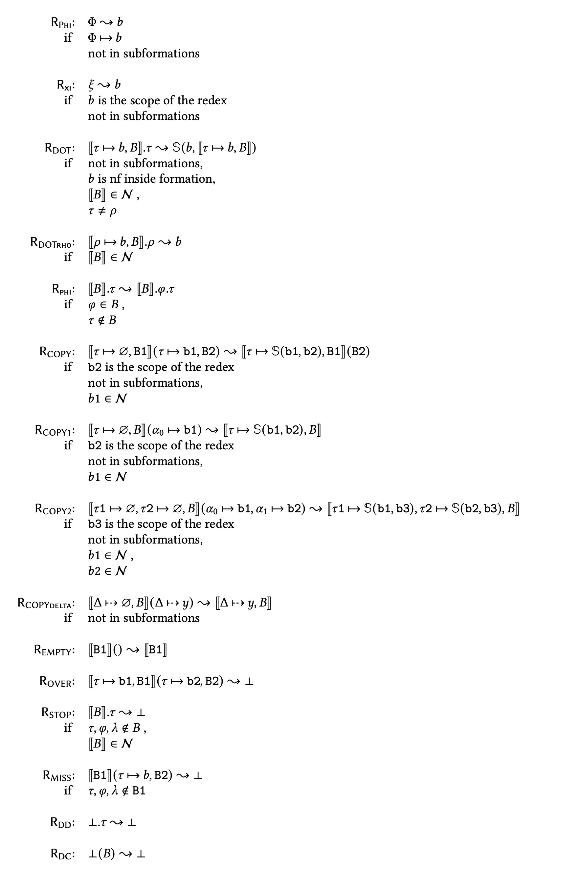
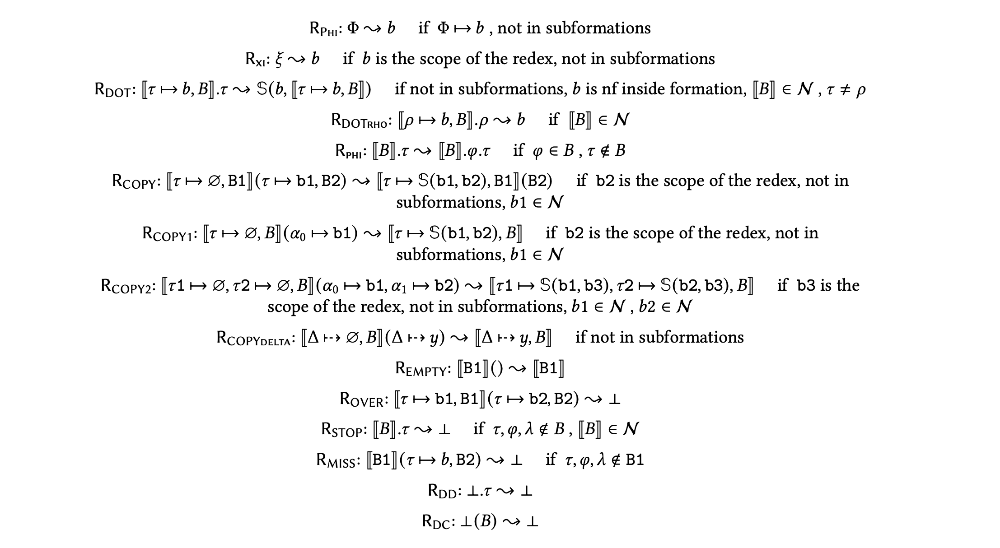

# `eo-phi-normalizer print-rules`

## CLI

### `--help`

```$ as console
eo-phi-normalizer print-rules --help
```

```console
Usage: eo-phi-normalizer print-rules [-r|--rules FILE] [--tex] [-c|--compact]

  Print rules in LaTeX format.

Available options:
  -r,--rules FILE          FILE with user-defined rules. If unspecified,
                           yegor.yaml is rendered.
  --tex                    Output LaTeX.
  -c,--compact             Print rules, each on a single line.
  -h,--help                Show this help text
```

### Default version

The command below prints to the console rules from [new.yaml](https://github.com/objectionary/eo-phi-normalizer/blob/master/eo-phi-normalizer/test/eo/phi/rules/new.yaml), listing each condition of the rules on a separate line.



```$ as tex
eo-phi-normalizer print-rules --tex
```

```tex
\begin{figure*}
\begin{tabular}{rl}
  \rrule{Phi}: & $ Q $ \(\trans\) $ b $ \\\text {if }& $ Q -> b $ \\&not in subformations\\\\
  \rrule{xi}: & $ \xi $ \(\trans\) $ b $ \\\text {if }& $ b $  is the scope of the redex\\&not in subformations\\\\
  \rrule{DOT}: & $ [[ \tau -> b, B ]].\tau $ \(\trans\) $ \mathbb{S}(b, [[ \tau -> b, B ]]) $ \\\text {if }&not in subformations,\\& $ b $  is nf inside formation,\\& $ [[ B ]]\in\mathcal{N} $ ,\\& $ \tau \neq ^ $ \\\\
  \rrule{DOTrho}: & $ [[ ^ -> b, B ]].^ $ \(\trans\) $ b $ \\\text {if }& $ [[ B ]]\in\mathcal{N} $ \\\\
  \rrule{phi}: & $ [[ B ]].\tau $ \(\trans\) $ [[ B ]].@.\tau $ \\\text {if }& $ @ \in B $ ,\\& $ \tau \notin B $ \\\\
  \rrule{COPY}: & $ [[ \tau -> ?, B1 ]]( \tau -> b1, B2 ) $ \(\trans\) $ [[ \tau -> \mathbb{S}(b1, b2), B1 ]]( B2 ) $ \\\text {if }& $ b2 $  is the scope of the redex\\&not in subformations,\\& $ b1\in\mathcal{N} $ \\\\
  \rrule{COPY1}: & $ [[ \tau -> ?, B ]]( 0-> b1 ) $ \(\trans\) $ [[ \tau -> \mathbb{S}(b1, b2), B ]] $ \\\text {if }& $ b2 $  is the scope of the redex\\&not in subformations,\\& $ b1\in\mathcal{N} $ \\\\
  \rrule{COPY2}: & $ [[ \tau1 -> ?, \tau2 -> ?, B ]]( 0-> b1, 1-> b2 ) $ \(\trans\) $ [[ \tau1 -> \mathbb{S}(b1, b3), \tau2 -> \mathbb{S}(b2, b3), B ]] $ \\\text {if }& $ b3 $  is the scope of the redex\\&not in subformations,\\& $ b1\in\mathcal{N} $ ,\\& $ b2\in\mathcal{N} $ \\\\
  \rrule{COPYdelta}: & $ [[ D> ?, B ]]( D> y ) $ \(\trans\) $ [[ D> y, B ]] $ \\\text {if }&not in subformations\\\\
  \rrule{EMPTY}: & $ [[ B1 ]](  ) $ \(\trans\) $ [[ B1 ]] $ \\\text {if }\\\\
  \rrule{OVER}: & $ [[ \tau -> b1, B1 ]]( \tau -> b2, B2 ) $ \(\trans\) $ \dead $ \\\text {if }\\\\
  \rrule{STOP}: & $ [[ B ]].\tau $ \(\trans\) $ \dead $ \\\text {if }& $ \tau, @, \lambda \notin B $ ,\\& $ ^ \in B $ ,\\& $ [[ B ]]\in\mathcal{N} $ \\\\
  \rrule{MISS}: & $ [[ B1 ]]( \tau -> b, B2 ) $ \(\trans\) $ \dead $ \\\text {if }& $ \tau, @, \lambda \notin B1 $ \\\\
  \rrule{DD}: & $ \dead.\tau $ \(\trans\) $ \dead $ \\\text {if }\\\\
  \rrule{DC}: & $ \dead( B ) $ \(\trans\) $ \dead $ \\\text {if }
\end{tabular}
\end{figure*}
```

### Compact version

The compact version prints rules listing all conditions on a single line.



```$ as tex
eo-phi-normalizer print-rules --tex --compact
```

```tex
\begin{figure*}
  \rrule{Phi}:  $ Q $ \(\trans\) $ b $ \quad\text {if } $ Q -> b $ , not in subformations\\\vspace*{0.5em}
  \rrule{xi}:  $ \xi $ \(\trans\) $ b $ \quad\text {if } $ b $  is the scope of the redex, not in subformations\\\vspace*{0.5em}
  \rrule{DOT}:  $ [[ \tau -> b, B ]].\tau $ \(\trans\) $ \mathbb{S}(b, [[ \tau -> b, B ]]) $ \quad\text {if }not in subformations,  $ b $  is nf inside formation,  $ [[ B ]]\in\mathcal{N} $ ,  $ \tau \neq ^ $ \\\vspace*{0.5em}
  \rrule{DOTrho}:  $ [[ ^ -> b, B ]].^ $ \(\trans\) $ b $ \quad\text {if } $ [[ B ]]\in\mathcal{N} $ \\\vspace*{0.5em}
  \rrule{phi}:  $ [[ B ]].\tau $ \(\trans\) $ [[ B ]].@.\tau $ \quad\text {if } $ @ \in B $ ,  $ \tau \notin B $ \\\vspace*{0.5em}
  \rrule{COPY}:  $ [[ \tau -> ?, B1 ]]( \tau -> b1, B2 ) $ \(\trans\) $ [[ \tau -> \mathbb{S}(b1, b2), B1 ]]( B2 ) $ \quad\text {if } $ b2 $  is the scope of the redex, not in subformations,  $ b1\in\mathcal{N} $ \\\vspace*{0.5em}
  \rrule{COPY1}:  $ [[ \tau -> ?, B ]]( 0-> b1 ) $ \(\trans\) $ [[ \tau -> \mathbb{S}(b1, b2), B ]] $ \quad\text {if } $ b2 $  is the scope of the redex, not in subformations,  $ b1\in\mathcal{N} $ \\\vspace*{0.5em}
  \rrule{COPY2}:  $ [[ \tau1 -> ?, \tau2 -> ?, B ]]( 0-> b1, 1-> b2 ) $ \(\trans\) $ [[ \tau1 -> \mathbb{S}(b1, b3), \tau2 -> \mathbb{S}(b2, b3), B ]] $ \quad\text {if } $ b3 $  is the scope of the redex, not in subformations,  $ b1\in\mathcal{N} $ ,  $ b2\in\mathcal{N} $ \\\vspace*{0.5em}
  \rrule{COPYdelta}:  $ [[ D> ?, B ]]( D> y ) $ \(\trans\) $ [[ D> y, B ]] $ \quad\text {if }not in subformations\\\vspace*{0.5em}
  \rrule{EMPTY}:  $ [[ B1 ]](  ) $ \(\trans\) $ [[ B1 ]] $ \quad\text {if }\\\vspace*{0.5em}
  \rrule{OVER}:  $ [[ \tau -> b1, B1 ]]( \tau -> b2, B2 ) $ \(\trans\) $ \dead $ \quad\text {if }\\\vspace*{0.5em}
  \rrule{STOP}:  $ [[ B ]].\tau $ \(\trans\) $ \dead $ \quad\text {if } $ \tau, @, \lambda \notin B $ ,  $ ^ \in B $ ,  $ [[ B ]]\in\mathcal{N} $ \\\vspace*{0.5em}
  \rrule{MISS}:  $ [[ B1 ]]( \tau -> b, B2 ) $ \(\trans\) $ \dead $ \quad\text {if } $ \tau, @, \lambda \notin B1 $ \\\vspace*{0.5em}
  \rrule{DD}:  $ \dead.\tau $ \(\trans\) $ \dead $ \quad\text {if }\\\vspace*{0.5em}
  \rrule{DC}:  $ \dead( B ) $ \(\trans\) $ \dead $ \quad\text {if }
\end{figure*}
```
