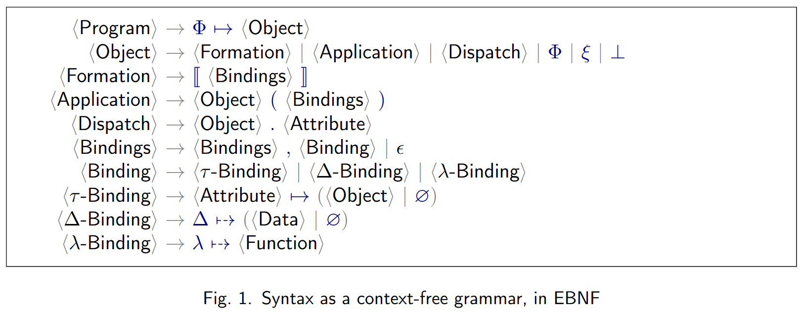

# Metrics

## PHI grammar

## We count

- [Object formations](#object-formations)
- [Object applications](#object-applications)
- [Dynamic dispatches](#dynamic-dispatches)
- [Dataless formations](#dataless-formations)

### Object formations

- Example: ` d ↦ ∅, c ↦ ∅ `

### Object applications

- Example: `ξ.b(c ↦  )`

### Dynamic dispatches

- Example: `ξ.ρ.c`

### Dataless formations

#### Definition: \\( \Delta \\)-depth

\\( \Delta \\)-depth of an object describes how deep data is in the object
when recursively traversing values attached to the object attributes.
That is, \\( \Delta \\)-depth is \\( \infty \\) for all objects except formations.
More specifically:

1. the \\( \Delta \\)-depth of a formation with bytes attached to a \\( \Delta \\)-attribute is \\( 1 \\);
1. for a non-empty formation, the \\( \Delta \\)-depth is:
   1. \\( 1 + M \\), where \\( M \\) is the minimal depth among objects attached to attributes of this formation;
   1. \\( \infty \\) if there are no objects attached to attributes of this formation;
1. otherwise, the \\( \Delta \\)-depth of an object is \\( \infty \\).

#### Definition: Dataless object

An object is dataless if its \\( \Delta \\)-depth is greater than 2.

#### Examples

The following table demonstrates objects with their \\( \Delta \\)-depths:

## CLI command

See [eo-phi-normalizer metrics](./eo-phi-normalizer/metrics.md).
